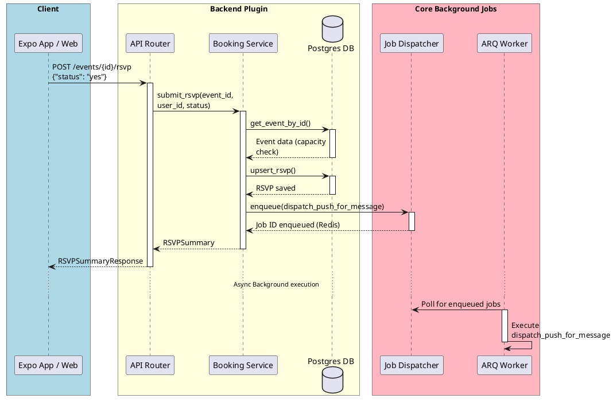
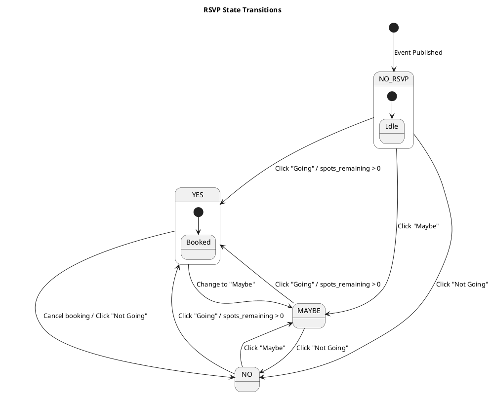

# PlantUML Diagram Examples

This guide provides concrete, copy-pasteable templates for the most common diagram types.

## 1. C4 Container Diagram (Architecture)

Use this to show how different applications (e.g. Next.js, Expo, FastAPI) and databases interact.

```plantuml
@startuml c4_containers
!include https://raw.githubusercontent.com/plantuml-stdlib/C4-PlantUML/master/C4_Container.puml

LAYOUT_WITH_LEGEND()

title System Architecture Container Diagram

Person(member, "Gym Member", "Views timetable, books classes, and tracks attendance.")
Person(instructor, "Instructor", "Checks in students and manages attendance.")

System_Boundary(prodanx, "ProDanX Platform") {
    Container(mobile, "Expo Mobile App", "React Native", "Provides member timetable, RSVP actions, and notifications.")
    Container(web, "Next.js Web Portal", "React / Tailwind", "Admin panels, instructor rosters, and public timetable.")
    Container(api, "FastAPI Backend", "Python / FastAPI", "Core API, tenant routing, and business logic plugins.")
    ContainerDb(db, "PostgreSQL Database", "PostgreSQL", "Stores core auth, tenant data, booking events, and RSVPs.")
}

Rel(member, mobile, "Uses")
Rel(instructor, web, "Uses")
Rel(mobile, api, "API Requests (JSON/HTTPS)")
Rel(web, api, "API Requests (JSON/HTTPS)")
Rel(api, db, "Reads/Writes (SQL/SQLAlchemy)")
@enduml
```

## 2. Sequence Diagram (Complex Workflows)

Use this to detail the step-by-step communication pattern, especially asynchronous operations like enqueuing background tasks.



## 3. State Diagram (Object Lifecycles)

Use this to document state changes of models (e.g. RSVPs, payment transactions, booking slots).


