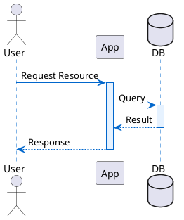

# t-plantuml-creation

Create architectural and workflow diagrams using PlantUML, adhering to C4 standards, clear visual layouts, and validating that they render successfully.

Binds: coding-explanation (state why a diagram type fits), git-policy
(read-only git). Model-neutral: any agent loads this file directly.

## Autonomy contract

- **Proceed freely:** drafting/updating `.puml` files, running the bundled
  validator, iterating on render errors.
- **Stop and ask:** installing new tooling, or placing diagrams outside the
  repo's established diagram directories.

## Quick start

Save PlantUML files to `Kanban/<name>.puml` or `docs/diagrams/<name>.puml`. Run the validation script on the diagram to ensure it renders correctly:

```bash
python3 .agents/skills/t-plantuml-creation/scripts/validate_diagram.py path/to/diagram.puml
```

Here is a minimal sequence diagram example:



For more diagram templates, see [EXAMPLES.md](EXAMPLES.md).

## Workflows

### 1. Select Diagram Type
- **C4 Model (Context/Container/Component):** Best for system boundaries, external dependencies, and macro component structures.
- **Sequence Diagram:** Best for multi-step synchronous or asynchronous interaction flows (e.g. API requests or background job enqueuing).
- **State/Activity Diagram:** Best for complex object lifecycles (e.g., Booking/RSVP state transitions).
- **Class/ER Diagram:** Best for database schema relationships.

### 2. Implementation Checklist
- [ ] Determine target file path (usually inside `Kanban/` or `docs/diagrams/` depending on the request).
- [ ] Draft/update the `.puml` file with modern skinparam palettes (e.g., sleek HSL/hex colors, soft rounded corners) to make it premium.
- [ ] Run the rendering validator to verify there are no syntax or formatting issues:
  ```bash
  python3 .agents/skills/t-plantuml-creation/scripts/validate_diagram.py <path_to_diagram.puml>
  ```
- [ ] If validation fails, correct the syntax error and re-run validation.
- [ ] Document the diagram in the task/issue text with a brief summary of what it shows, why that type was selected, and confirm it rendered successfully.
